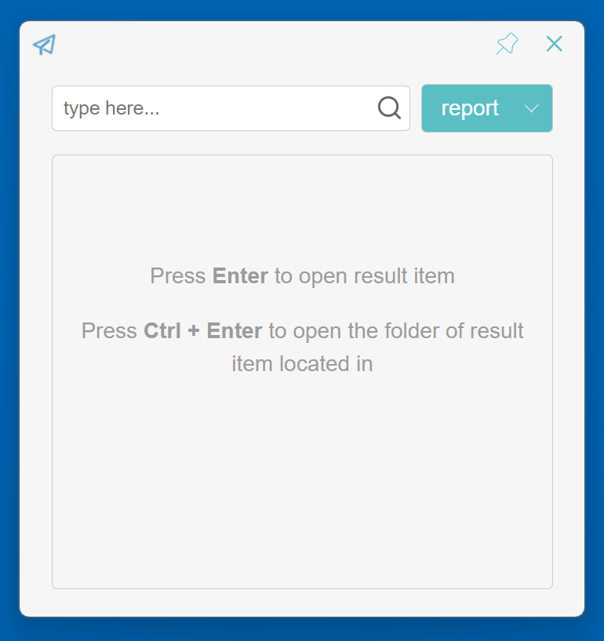
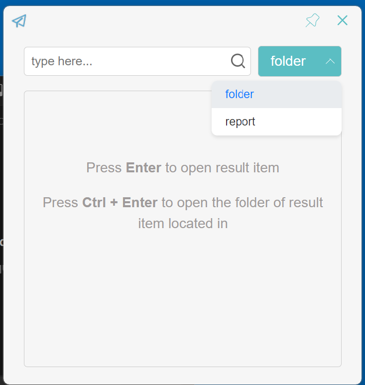
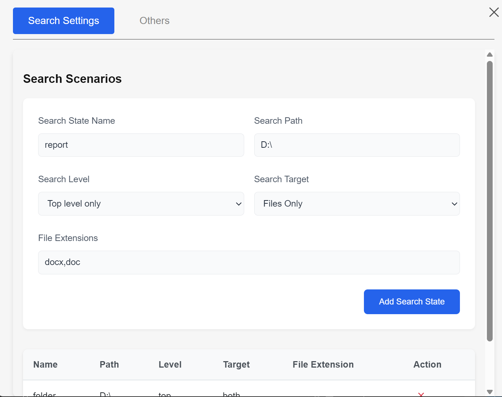
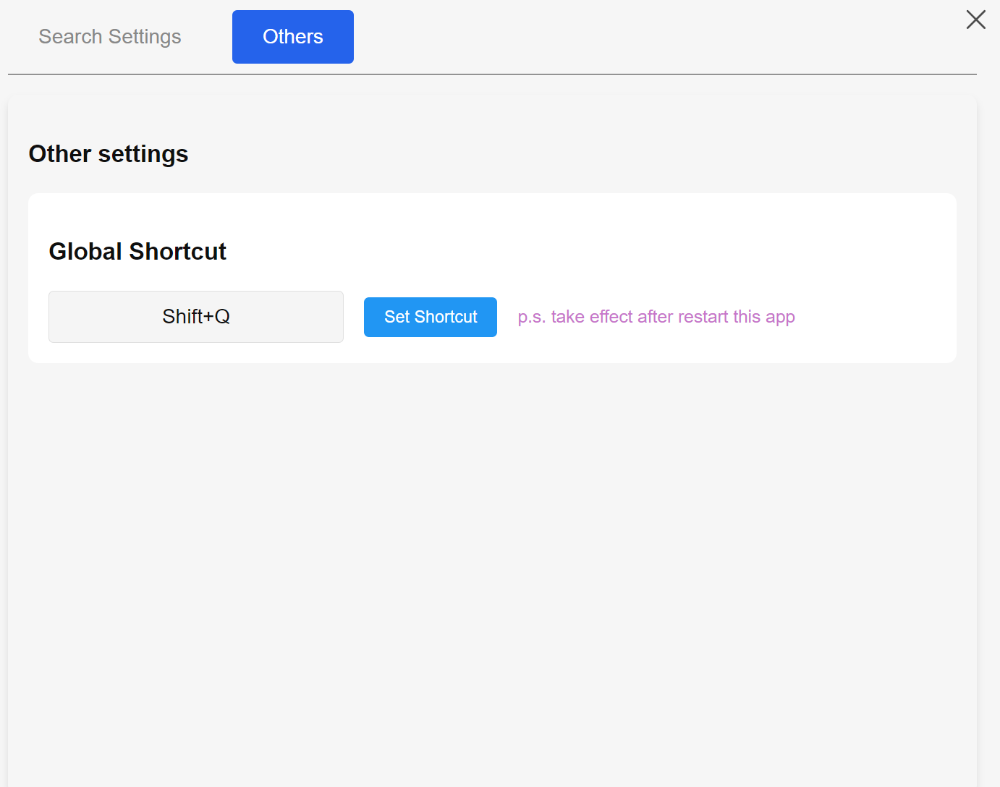
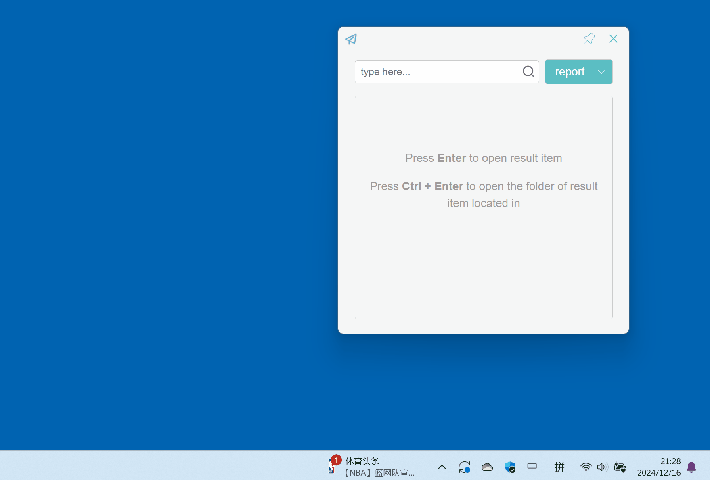

# Finder

A powerful and fast file search application built with Tauri, SvelteKit, and TypeScript. This desktop application allows you to quickly search through your files with advanced features and customizable search scenarios.

## Features

### Core Search Functionality
- 🔍 Fast file search across directories
- 📁 Customizable search scenarios with configurable paths
- 🎯 Multiple search targets (filename, content)
- 📊 Search depth level control
- 🗃️ File extension filtering
- 📂 Quick folder access with Ctrl+Enter
- 🔄 Recently used files prioritization

### User Interface
- 💫 Modern and responsive UI built with SvelteKit
- 🎨 Clean and intuitive search interface
- ⚡ Real-time search results
- 📌 Always-on-top window option
- 🔄 Search history tracking
- ⌨️ Keyboard navigation support
- 💡 Helpful UI hints

### Advanced Features
- ⌨️ Global keyboard shortcuts support
- 🏃‍♂️ Parallel search processing for better performance
- ⏱️ Search timeout protection (30 seconds)
- 🔍 Search cancellation support
- ⚙️ Customizable search scenarios

### System Integration
- 🖥️ System tray integration
- 🚀 Native performance with Tauri
- 📱 Cross-platform support

## Tutorial

### Main Interface

The main interface consists of a search input field and a dropdown to select search scenarios. Use the search input to type your query and press Enter to search.

### Keyboard Shortcuts
- `Enter`: Open the selected file
- `Ctrl + Enter`: Open the folder containing the selected file
- `↑/↓`: Navigate through search results

### Search Scenarios

Select different search scenarios from the dropdown menu. Each scenario can be customized with specific paths and search settings.

### Settings
The settings page allows you to customize various aspects of the application:

1. **Search Scenarios Configuration**


- Add, or remove search scenarios
- Configure search paths and file extensions
- Set search depth and target type

2. **Global Shortcut**

- Set a global keyboard shortcut to quickly access Finder from anywhere
- The shortcut will take effect after restarting the application


### System Tray

Access Finder quickly from the system tray. Right-click the tray icon for additional options.

## Getting Started

### Prerequisites
- [Node.js](https://nodejs.org/)
- [Rust](https://www.rust-lang.org/)

### Installation

1. Clone the repository
```bash
git clone [your-repo-url]
cd finder
```

2. Install dependencies
```bash
npm install
```

3. Run in development mode
```bash
npm run tauri dev
```

4. Build for production
```bash
npm run tauri build
```

## Tech Stack

- **Frontend**: SvelteKit + TypeScript
- **Backend**: Rust + Tauri
- **Build Tool**: Vite
- **Package Manager**: pnpm

## Recommended IDE Setup

[VS Code](https://code.visualstudio.com/) with the following extensions:
- [Svelte](https://marketplace.visualstudio.com/items?itemName=svelte.svelte-vscode)
- [Tauri](https://marketplace.visualstudio.com/items?itemName=tauri-apps.tauri-vscode)
- [rust-analyzer](https://marketplace.visualstudio.com/items?itemName=rust-lang.rust-analyzer)

## License

[MIT](LICENSE)
